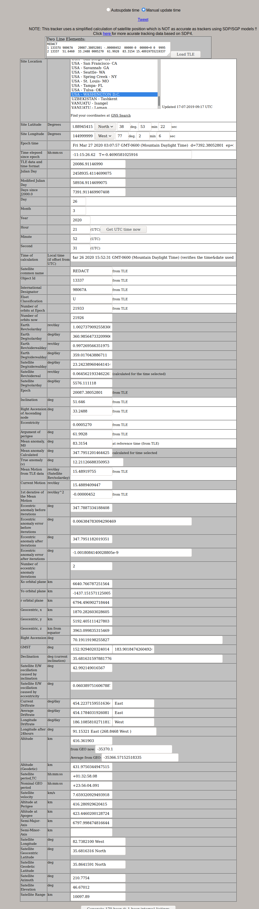
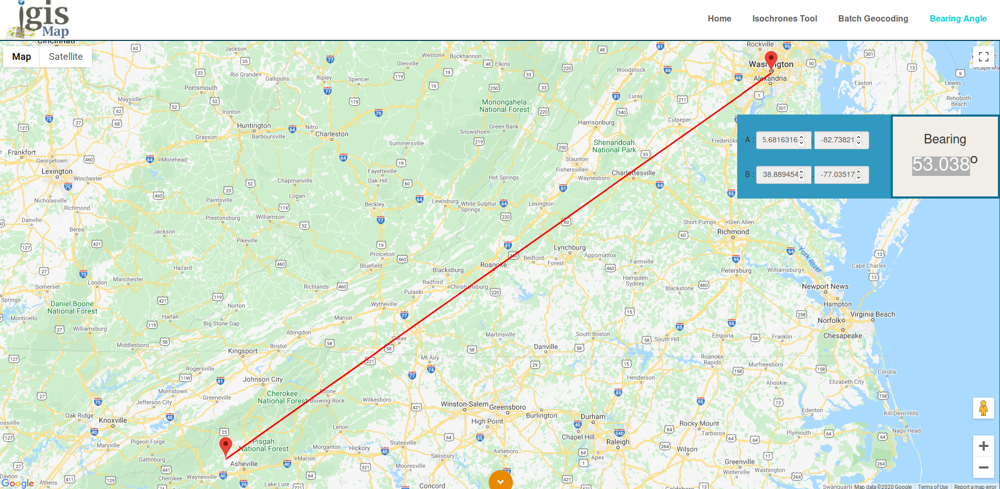

```
REDACT
1 13337U 98067A   20087.38052801 -.00000452  00000-0  00000+0 0  9995
2 13337  51.6460  33.2488 0005270  61.9928  83.3154 15.48919755219337
```
## Find the current satellite location

We found a satellite TLE calculation tool online that made it fairly easy to
figure out the location of the satellite at any given point in time. 

#### http://www.satellite-calculations.com/TLETracker/SatTracker.htm

 - Copy the TLE lines into the tool and load the TLE
 - Edit the time and date fields to match your target time
 - Find the "geo-centric" latitude and longitude and height and range data that was calculated
   and fill in the blanks on the example KML document



The azimuth and inclination values provided aren't quite right when you load the KML 
document into Google earth. So, I used a bearing calculator online to figure out
what the correct bearing should be.

#### https://www.igismap.com/map-tool/bearing-angle

 - Enter in the lat/long location of the satellite first
 - Enter use google earth to find the latitude and longitude of the Washington 
   Monument and put that in as the second value
 - Add the bearing into the KML document



## Tweak the tilt

I initially used the declination values from the satellit tracker page, but it 
didn't quite line up with the washington monument for some reason.  I'm not
exactly sure why it wasn't correct.  Anyways, I started tweaking the tilt
manually by over shooting in the other directly and using a simple binary style
search (go halfway between the last two tries) until I found the correct tilt
to line it up.

Then the flag appears.  Here was the final KML document:

```
<?xml version="1.0" encoding="UTF-8"?>
<kml xmlns="http://www.opengis.net/kml/2.2">
  <Folder>
    <name>HackASatCompetition</name>
    <visibility>0</visibility>
    <open>0</open>
    <description>HackASatComp1</description>
    <NetworkLink>
      <name>View Centered Placemark</name>
      <visibility>0</visibility>
      <open>0</open>
      <description>This is where the satellite was located when we saw it.</description>
      <refreshVisibility>0</refreshVisibility>
      <flyToView>0</flyToView>
      <LookAt id="13337">
        <!-- specific to LookAt -->
        <longitude>-82.7382100</longitude>            	<!-- kml:angle180 -->
        <latitude>35.6816316</latitude>              	<!-- kml:angle90 - geodedic lat -->
        <altitude>416361.903</altitude>              		<!-- double -->
        <heading>53.038</heading>                <!-- kml:angle360 -->
        <tilt>54.15</tilt>                     <!-- kml:anglepos90 (90-declination, with manual tweaking) -->
        <range>10097.89</range>                     <!-- double -->
        <altitudeMode>absolute</altitudeMode>
      </LookAt>
      <Link>
        <href>http://3.14.9.244:17598/cgi-bin/HSCKML.py</href>
        <refreshInterval>1</refreshInterval>
        <viewRefreshMode>onStop</viewRefreshMode>
        <viewRefreshTime>1</viewRefreshTime>
        <viewFormat>BBOX=[bboxWest],[bboxSouth],[bboxEast],[bboxNorth];CAMERA=[lookatLon],[lookatLat],[lookatRange],[lookatTilt],[lookatHeading];VIEW=[horizFov],[vertFov],[horizPixels],[vertPixels],[terrainEnabled]</viewFormat>
      </Link>
    </NetworkLink>
  </Folder>
</kml>
```