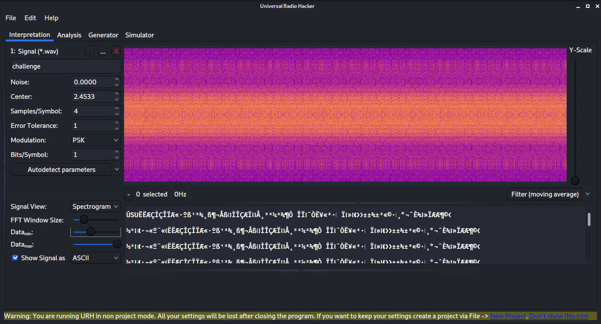
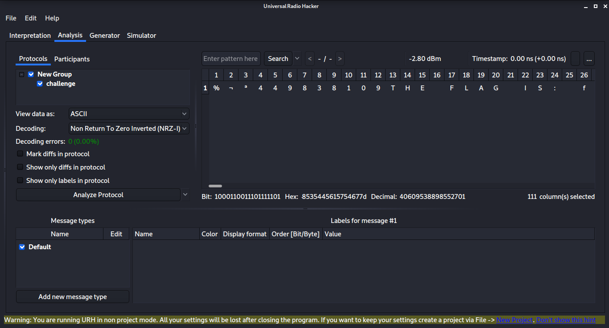

# Universal Radio Hacker

## Tools used

 - [Universal Radio Hacker](https://github.com/jopohl/urh)

## Interpret the signal

Start up Universal Radio Hacker (uhr) and load up the wave file.

I started by flipping the modulation modes and hitting the "Autodetect parameters" 
button until PSK was able to detect the signal parameters for me.

Go to the analysis tab.

I now flopped through the decoding values and hit "Analyze Protocol" until
the "Non return to Zero Inverted (NRZ-I)" gave legible data.  You can see
"THE FLAG IS:" in the screenshot below.

Copy out the data, paste in a text editor and there the flag is.